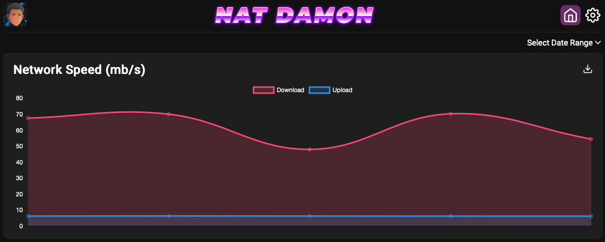

# Nat Damon


## Introduction
Nat Damon is an application designed to periodically run network tests and log the results.

It has 2 components:
- Logger Daemon (Runs speedtest-cli and ping tests at configurable cron intervals.)
- Web Daemon (Web pages for viewing test results and configuring test intervals.)

## Pre-Requisites
Pre-requisites:
- Linux or MacOS
- Node.js v12
- Git
- speedtest-cli

## Installation
Download the project and install npm dependencies:
```bash
$ git clone https://github.com/SecondSerenity/NatDamon.git
$ cd NatDamon
$ npm install
```

Run the installation script.
```bash
$ ./bin/setup.js
```
- You will be prompted to set a password for the web login.

## Running Nat Damon
Running the web server:
```bash
$ ./bin/server.js
```
- By default, the webserver will be accessible on port 8080. You can change the port using the `--port` option.
```bash
$ ./bin/server.js --port=3000
```

Test the logging service.
```bash
$ ./bin/logger.js
```

## Daemonize Nat Damon
This project does not **yet** include a method to run Nat Damon in the background.
Two suggested methods to run Nat Damon:
- **screen**
- **systemd**

